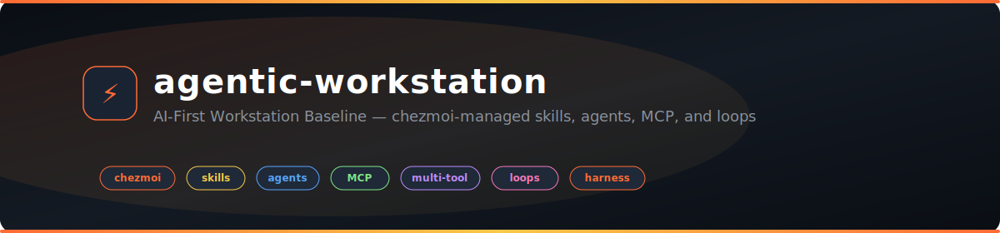

<div align="center">

<picture>
  <source media="(prefers-color-scheme: dark)" srcset="static/hero-banner.svg">
  <source media="(prefers-color-scheme: light)" srcset="static/hero-banner.svg">
  
</picture>

<br>
<br>

[](#personal-dx-stack)
[](#what-you-get)
[](#what-you-get)
[](https://github.com/ulises-jeremias/agentic-workstation/actions/workflows/devcontainer-chezmoi-validate.yml)

<h3>One command to turn a machine into an AI-native developer workstation.</h3>

<p>
  <strong>agentic-workstation</strong> is the baseline layer of my personal Developer Experience stack:<br>
  reproducible dotfiles, AI skills, MCP servers, agent workflows, and CLI guardrails optimized for deep flow.
</p>

[Install](#quick-start) · [Wiki](https://github.com/ulises-jeremias/agentic-workstation/wiki) · [Integrations](#integrations) · [Personal DX Stack](#personal-dx-stack) · [Docs](docs/) · [Contributing](CONTRIBUTING.md)

</div>

---

**agentic-workstation** is an AI-first, chezmoi-managed workstation baseline that equips your machine with skills, agents, MCP servers, CLI helpers, and loop engineering primitives — ready to go in one command.

Works with **Claude Code**, **opencode**, **Cursor**, **Gemini CLI**, **GitHub Copilot**, and any AI coding tool that supports agent skills.

---

## What You Get

<table>
  <tr>
    <td width="33%" align="center">
      <br>
      <b>🧩 Skills System</b><br>
      <sub>52 reusable skill packs for Jira, Confluence, ClickUp, Figma, GitHub, GitLab, Slack, dbt, Snowflake, Playwright, and more</sub>
    </td>
    <td width="33%" align="center">
      <br>
      <b>🤖 AI Agents</b><br>
      <sub>Pre-configured agents for code review, security audit, TDD, refactoring, planning, architecture, and E2E testing</sub>
    </td>
    <td width="33%" align="center">
      <br>
      <b>🔌 MCP Templates</b><br>
      <sub>Self-configuring MCP provider templates for LLM servers, APIs, and data sources — zero manual setup</sub>
    </td>
  </tr>
  <tr>
    <td width="33%" align="center">
      <br>
      <b>🛠️ CLI Helpers</b><br>
      <sub><code>dots-doctor</code> · <code>dots-skills</code> · <code>dots-mcp</code> · <code>dots-loop</code> · <code>dots-loadenv</code> — 60+ CLI commands</sub>
    </td>
    <td width="33%" align="center">
      <br>
      <b>🔄 Loop Engineering</b><br>
      <sub>Structured agent loops with cost estimation, telemetry, drift detection, and automated improvement cycles</sub>
    </td>
    <td width="33%" align="center">
      <br>
      <b>🎯 Multi-Tool Sync</b><br>
      <sub>One skill registration across Claude Code, opencode, Cursor, Copilot CLI, Pi, and Windsurf — no duplicates</sub>
    </td>
  </tr>
</table>

---

## Quick Start

### Just want the AI skills?

Add 52+ AI skill packs to your existing setup in one command — **no dotfiles, no chezmoi, no shell changes**:

```bash
curl -fsSL https://github.com/ulises-jeremias/agentic-workstation/releases/latest/download/install-skills.sh | bash
```

Works instantly with **Claude Code, opencode, Cursor, GitHub Copilot, and Gemini CLI**. [Learn more →](https://github.com/ulises-jeremias/agentic-workstation/wiki/GUIDED_AI_INSTALL)

### Full workstation (dotfiles + skills + everything)

```bash
chezmoi init --apply ulises-jeremias/agentic-workstation
```

<table>
  <tr>
    <th>If you want to…</th>
    <th>Follow this</th>
  </tr>
  <tr>
    <td>Set up your entire machine from scratch</td>
    <td><a href="https://github.com/ulises-jeremias/agentic-workstation/wiki/TECHNICAL_QUICKSTART">📘 Wiki Quick Start</a></td>
  </tr>
  <tr>
    <td>Add AI skills to an existing setup</td>
    <td><a href="https://github.com/ulises-jeremias/agentic-workstation/wiki/GUIDED_AI_INSTALL">📘 Guided AI Install</a></td>
  </tr>
  <tr>
    <td>Choose your profile and answer prompts</td>
    <td><a href="https://github.com/ulises-jeremias/agentic-workstation/wiki/PROFILES">📘 Profiles</a> · <a href="https://github.com/ulises-jeremias/agentic-workstation/wiki/QUESTIONNAIRE">📘 Questionnaire</a></td>
  </tr>
  <tr>
    <td>Configure credentials and integrations</td>
    <td><a href="https://github.com/ulises-jeremias/agentic-workstation/wiki/CREDENTIALS">📘 Credentials</a> · <a href="https://github.com/ulises-jeremias/agentic-workstation/wiki/INTEGRATIONS">📘 Integrations</a></td>
  </tr>
  <tr>
    <td>Use the CLI</td>
    <td><a href="https://github.com/ulises-jeremias/agentic-workstation/wiki/CLI">📘 CLI Reference</a></td>
  </tr>
</table>

---

## Integrations

Seamless skill packs for the tools you use every day:

<table>
  <tr>
    <td align="center"><b>📋 Jira</b></td>
    <td align="center"><b>📄 Confluence</b></td>
    <td align="center"><b>✅ ClickUp</b></td>
    <td align="center"><b>💬 Slack</b></td>
  </tr>
  <tr>
    <td align="center"><sub>Issues, sprints, epics, JQL, time tracking, admin</sub></td>
    <td align="center"><sub>Pages, spaces, search, permissions, templates, analytics</sub></td>
    <td align="center"><sub>Tasks, docs, sprints, goals, comments, templates</sub></td>
    <td align="center"><sub>Channels, messages, canvases, reactions, notifications</sub></td>
  </tr>
  <tr>
    <td align="center"><b>🐙 GitHub</b></td>
    <td align="center"><b>🦊 GitLab</b></td>
    <td align="center"><b>🎨 Figma</b></td>
    <td align="center"><b>📊 Linear</b></td>
  </tr>
  <tr>
    <td align="center"><sub>PRs, issues, CI, releases, comments, code review</sub></td>
    <td align="center"><sub>MRs, issues, CI/CD, pipelines, merge requests</sub></td>
    <td align="center"><sub>Designs, components, variables, code generation, code connect</sub></td>
    <td align="center"><sub>Issues, projects, cycles, teams, triage, roadmaps</sub></td>
  </tr>
  <tr>
    <td align="center"><b>🗄️ dbt</b></td>
    <td align="center"><b>❄️ Snowflake</b></td>
    <td align="center"><b>🎭 Playwright</b></td>
    <td align="center"><b>📓 Jupyter</b></td>
  </tr>
  <tr>
    <td align="center"><sub>Parse, compile, test, selective run, CI validation</sub></td>
    <td align="center"><sub>Read-only SQL validation, warehouse introspection</sub></td>
    <td align="center"><sub>E2E tests, browser automation, snapshots, traces</sub></td>
    <td align="center"><sub>Scaffold, run, refactor notebooks — reproducible science</sub></td>
  </tr>
</table>

---

## 📂 Repository Map

```text
agentic-workstation/
├── home/                    # Chezmoi source state → your $HOME
├── docs/                    # Architecture, ADRs, maintainer guides
├── scripts/                 # Validation, install, and CI helpers
├── static/                  # Banner and media assets
├── .github/workflows/       # 12 CI workflows
├── AGENTS.md                # AI agent guidelines
├── CHANGELOG.md             # Release history
├── CONTRIBUTING.md          # How to contribute
├── SECURITY.md              # Security policy
├── install.sh               # Bootstrap installer (Unix)
├── install.ps1              # Bootstrap installer (Windows)
└── .chezmoiroot → home/     # Chezmoi source root
```

---

## 📋 Architecture Decisions

Key decisions are recorded as ADRs — immutable once accepted, superseded by new ADRs when revisited.

| ADR | Decision | Status |
| --- | --- | --- |
| [001](docs/adrs/001-chezmoi-home-source-state.md) | Use `home/` as chezmoi source state | ✅ Accepted |
| [002](docs/adrs/002-profile-driven-tooling.md) | Profile-driven tooling model | ✅ Accepted |
| [003](docs/adrs/003-ai-and-mcp-baseline.md) | AI and MCP baseline in shared local paths | ✅ Accepted |
| [004](docs/adrs/004-skills-compatibility-matrix.md) | Skills system with per-tool compatibility matrix | ✅ Accepted |
| [005](docs/adrs/005-llm-provider-abstraction.md) | LLM provider abstraction for dev companion runner | ✅ Accepted |
| [006](docs/adrs/006-multi-tool-portability.md) | Multi-tool portability via symlinks and thin adapters | ✅ Accepted |
| [007](docs/adrs/007-agentic-harness-three-layers.md) | Agentic harness with three-layer architecture | ✅ Accepted |
| [008](docs/adrs/008-dev-companion-queue-safety.md) | Dev companion queue with plan-only default | ✅ Accepted |
| [009](docs/adrs/009-keep-name-refresh-tagline.md) | Keep name, refresh tagline | ⏪ Superseded |
| [010](docs/adrs/010-rename-to-agentic-workstation.md) | Rename to agentic-workstation | ✅ Accepted |

---

## Personal DX Stack

<table>
  <tr>
    <td width="33%" valign="top">
      <strong>dotfiles</strong><br>
      <sub>The personal operating layer: shell, editor, terminal, packages, and day-to-day ergonomics.</sub>
      <br><br>
      <a href="https://github.com/ulises-jeremias/dotfiles"><code>ulises-jeremias/dotfiles</code></a>
    </td>
    <td width="34%" valign="top">
      <strong>agentic-workstation</strong><br>
      <sub>The AI-native workstation baseline: skills, agents, MCP templates, CLI helpers, and setup automation.</sub>
      <br><br>
      <a href="https://github.com/ulises-jeremias/agentic-workstation"><code>ulises-jeremias/agentic-workstation</code></a>
    </td>
    <td width="33%" valign="top">
      <strong>agentic-harness</strong><br>
      <sub>The running instance layer: persistent memory, indexed repos, personas, packs, and background loops.</sub>
      <br><br>
      <a href="https://github.com/ulises-jeremias/agentic-harness"><code>ulises-jeremias/agentic-harness</code></a>
    </td>
  </tr>
</table>

Together, these three projects form my personal workspace: a polished Developer Experience / UX system that optimizes setup, context switching, AI-assisted delivery, and daily workflow automation.

---

## 🛠️ Development Checks

```bash
bash scripts/check-markdown-tables.sh
bash scripts/check-shell-syntax.sh
bash scripts/validate-repo-structure.sh
git diff --check
```

> **Contributing:** See [CONTRIBUTING.md](CONTRIBUTING.md) for PR guidelines, commit conventions, and branch naming.

---

## 🔒 Security

Never commit credentials, tokens, or private keys. Use the [wiki credentials flow](https://github.com/ulises-jeremias/agentic-workstation/wiki/CREDENTIALS) for local secrets.

---

<div align="center">

**⭐ Star this repo** if you use it — it helps others discover it.

[Report a bug](https://github.com/ulises-jeremias/agentic-workstation/issues/new?template=BUG_REPORT.md) · [Request a feature](https://github.com/ulises-jeremias/agentic-workstation/issues/new?template=FEATURE_REQUEST.md)

<sub>Built with ❤️ for AI-assisted software delivery</sub>

</div>
