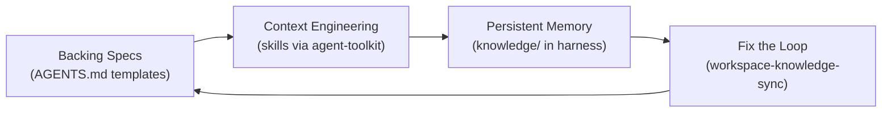
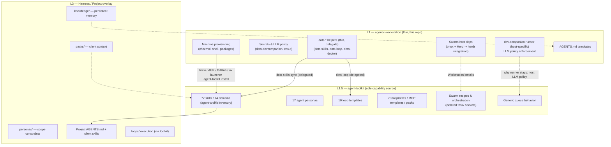

# Agentic Harness Framework

> The conceptual and operational framework behind agentic-workstation AI tooling.
> **Thin-host: Workstation provisions the machine, Toolkit distributes capabilities.**

---

## What is an Agentic Harness?

An **agentic harness** is the infrastructure layer that amplifies an AI tool. It provides:

- **Persistent memory** — knowledge that survives across sessions
- **Context engineering** — exactly the right information at the right time
- **Workflow orchestration** — routing tasks to the right skills and subagents
- **Specs and conventions** — telling the AI *how* to work, not just *what* to do

The harness doesn't replace your AI tool — it makes it dramatically more effective by solving the stateless session problem.

---

## The Ralph Loop

The harness implements the **Ralph Loop** — a four-phase feedback cycle described by [Geoffrey Huntley](https://ghuntley.com/loop/):

```text
┌─────────────────────────────────────────────────────────┐
│                      Ralph Loop                          │
│                                                          │
│  Backing Specs  →  Context Engineering                   │
│       ↑                   ↓                              │
│  Fix the Loop  ←  Persistent Memory                      │
└─────────────────────────────────────────────────────────┘
```

### How agentic-workstation implements it



| Ralph Concept | agentic-workstation Implementation | Layer |
|---------------|------------------------|-------|
| **Backing specifications** | `AGENTS.md` templates in `home/.chezmoitemplates/agents/` | L1 |
| **Context engineering** | `agent-toolkit` skills (77 skills via `agent-toolkit inventory`) — symlinked via `dots-skills sync` | L1.5 → L3 |
| **Persistent memory** | `agentic-harness` / `ai-workspace` `knowledge/` — session discoveries | L3 |
| **Fix the loop** | `dots-harness-knowledge-sync` skill — auto-syncs | L1 → L3 |

---

## The Three Layers — L1 / L1.5 / L3 (thin host)

> **Canonical model: L1 Workstation, L1.5 Toolkit, L3 Harness/Project.**
> Earlier docs used L1/L2/L3 (Workstation/Workspace/Skills) — that model is superseded by the thin-host split where Toolkit is the sole capability source.



The harness has three distinct layers:

### Layer 1 — Workstation (this repo, thin)

The **machine provisioning + host runner** layer:

- Provisions the machine: chezmoi, shell, packages, LLM policy (`dots-devcompanion`, `~/.config/agentic-workstation/env.d/`), tmux/Herdr, and Toolkit installation (`dots-skills install-toolkit` → `agent-toolkit install`)
- Provides thin `dots-*` helpers that **delegate** to `agent-toolkit` (`dots-skills sync`, `dots-loop`, `dots-doctor` + `agent-toolkit swarm doctor`)
- Retains host-specific runner `dev-companion/runner` + policy enforcement (`policy.py`, `llm-audit.log`) — stays in Workstation because LLM policy is host-specific and must fail closed per engagement
- Manages `AGENTS.md` templates for repos (`home/.chezmoitemplates/agents/`)

> **Workstation installs tools, Toolkit owns orchestration.** Workstation ensures `tmux`/`Herdr`/`herdr integration install opencode` exist; Toolkit owns `agent-toolkit swarm …` and generic queue orchestration.

→ See `docs/ARCHITECTURE.md` and `docs/AGENT_TOOLKIT.md` for thin-host details. See `docs/AI_LAYER.md` for directory mapping.

> [!NOTE]
> This layer is what `agentic-workstation` provides. Capability content (skills, loops, agents, MCP) is delegated to L1.5.

### Layer 1.5 — agent-toolkit (sole capability source)

The **capability distribution** layer:

- **77 skills / 14 domains** (`agent-toolkit inventory`), 17 agent personas, 10 loop templates, 7 tool profiles, 7 MCP templates, packs, prompts
- Owns **swarm orchestration**: recipes, isolated tmux sockets (`agent-toolkit-swarm-<run-id>`), `agent-toolkit swarm doctor` / `agent-toolkit swarm start --recipe pair --ui herdr|tmux --runner opencode`
- Owns **generic queue behavior** (job JSON schema, queue directories) — host-specific LLM dispatch stays in Workstation's `dots-devcompanion` runner
- Deployed via `dots-skills install-toolkit` (brew / AUR `agent-toolkit-bin` / GitHub / `uv tool install --force 'agent-toolkit-cli>=1.11.0'`) then `agent-toolkit install`

→ See [`docs/AGENT_TOOLKIT.md`](AGENT_TOOLKIT.md) and `agent-toolkit` repo.

### Layer 3 — Harness / Project overlay

The **running instance + specialization** layer:

- Persists knowledge across sessions (`knowledge/`)
- Manages project context (repos, packs, personas) and project `AGENTS.md`
- Runs loops via `agent-toolkit loop` / `dots-loop` (templates from L1.5) and queue via `dots-devcompanion` (host runner) + `agent-toolkit devcompanion` (generic queue)
- Client/account-specific skills and packs overlay on top of L1.5

→ See [agentic-harness](https://github.com/ulises-jeremias/agentic-harness) (L3 harness) and `docs/SKILLS.md` for skill taxonomy. `bin/` CLIs in harness are `agent-toolkit workspace` / `agent-toolkit loop` / `dots-*` wrappers — not legacy `bin/loop`.

---

## Session Lifecycle

```mermaid
flowchart TD
    A[AI tool opens workspace] --> B[Read AGENTS.md]
    B --> C{Load pack?}
    C -->|Yes| D[Inject project context (L3)]
    C -->|No| E[Use defaults]
    D --> F{Activate persona?}
    E --> F
    F -->|Yes| G[Constrain scope (L1.5 persona)]
    F -->|No| H[Full scope]
    G --> I[Check knowledge/ (L3)]
    H --> I
    I --> J[Work → discover → delegate to L1.5 skills]
    J --> K[Save learnings (L3 knowledge/)]
    K --> L[Close session]
```

A typical AI session with the harness:

```text
1. AI tool opens workspace directory
2. Reads AGENTS.md (L3, template from L1) → understands context, routing, rules
3. (Optional) load pack (L3) → injects project-specific context
4. (Optional) activate persona (L1.5) → constrains scope
5. Check knowledge/ (L3) → what did we learn before?
6. Work → discover → delegate to skills/subagents (L1.5 via dots-skills symlinks)
7. Save → assistant-memory add --type learning "..." (L3)
8. Close session → discoveries persist in knowledge/
```

The harness ensures step 5 ("what did we learn before?") always has useful answers.

> [!TIP]
> Use `assistant-memory search "topic"` to check if prior sessions discovered relevant patterns before asking the user.

---

## Swarm provisioning — Workstation installs, Toolkit orchestrates

> **Workstation installs tools, Toolkit owns orchestration.** Verified via `dots-doctor` + `agent-toolkit swarm doctor`. Parallel to DevCompanion boundary: Workstation's `dots-devcompanion` runner stays host-specific (LLM policy); Toolkit owns generic queue behavior.

- **L1 provisions:** `tmux` (apt/brew/pacman/dnf, isolated socket `agent-toolkit-swarm-<run-id>`, no `~/.tmux.conf` overwrite), `Herdr` (brew→mise→`https://herdr.dev/install.sh`), `herdr integration install opencode`
- **L1.5 orchestrates:** `agent-toolkit swarm start --recipe pair --ui herdr|tmux --runner opencode`, `agent-toolkit swarm doctor`, recipes

See [SWARM_SETUP.md](SWARM_SETUP.md) and [ARCHITECTURE.md](ARCHITECTURE.md#swarm-provisioning--workstation-installs-toolkit-orchestrates).

## DevCompanion boundary — why runner stays in Workstation

`dots-devcompanion` (`dev-companion/runner`, `policy.py`, `DOTS_AI_DEVCOMPANION_LLM_*`, `~/.config/agentic-workstation/env.d/`, `llm-audit.log`) stays in **L1** because LLM policy is **host-specific**: it holds per-engagement secrets and must `llm-status` without invoking a model and `fail closed` (`strict=1` → `policy_violation` exit 2) when no allowed provider is available. `agent-toolkit` owns the **generic queue** (job JSON schema, `pending/processing/done/failed` directories, `agent-toolkit devcompanion queue …` plumbing) but has no provider awareness (see [DEV_COMPANION_LLM.md](DEV_COMPANION_LLM.md) and [DEV_COMPANION_IDE_ROADMAP.md](DEV_COMPANION_IDE_ROADMAP.md) Mode A/B/C).

---

## Portability

The harness is designed to work with multiple AI tools:

| AI Tool | Entry point |
|---------|-------------|
| Claude Code | `AGENTS.md` |
| opencode | `AGENTS.md` |
| Cursor | `CLAUDE.md` → symlink |
| Gemini CLI | `AGENTS.md` (no dedicated symlink yet; planned) |
| GitHub Copilot | `.github/copilot-instructions.md` → symlink |

The workstation (`dots-skills sync` delegated to `agent-toolkit`) manages the per-tool skill directories. The workspace manages the per-session context files.

---

## Generic Harness Starter

The `agentic-harness` serves dual purposes:

1. **agentic-workstation running instance** — with team-specific processes, client packs, and accumulated knowledge (L3)
2. **Generic starter** — the `main` branch contains a fully generic, team-agnostic version that anyone can clone and use

If you're setting up a new AI workspace (personal or for a new client team), start from the repo:

```bash
git clone git@github.com:ulises-jeremias/agentic-harness ~/.ai-workspace
# or agent-toolkit workspace init (Toolkit-owned scaffolding)
agent-toolkit workspace init
```

---

## Key Design Decisions

### Orchestrator, not expert

The workspace orchestrator session is a **router**, not an expert. It:
1. Determines task type
2. Delegates to the right skill or subagent (L1.5 skills via `dots-skills` symlinks)
3. Reports results
4. Saves knowledge (L3)

Specialists (code-reviewer, security-reviewer, tdd-guide) do the deep work.

### Personas constrain scope

Personas define what the AI **does**, not who it is. `reviewer` means "analyze and report, no changes" — not "you are a senior engineer". Constraint-first framing prevents scope creep.

### Packs manage context switching

When working across multiple clients, packs bundle the context (repos, IDs, conventions) needed to switch contexts without re-teaching the AI. Load a pack, get full context.

### Knowledge compounds

Every correction, every discovered pattern, every learned ID gets saved to `knowledge/`. The workspace gets more effective over time because the loop improves itself.

---

## References

- [The Ralph Loop](https://ghuntley.com/loop/) — Geoffrey Huntley's original concept
- [AI_LAYER.md](AI_LAYER.md) — skills system and Ralph Loop mapping
- [ARCHITECTURE.md](ARCHITECTURE.md) — thin-host architecture (L1/L1.5/L3)
- [AGENT_TOOLKIT.md](AGENT_TOOLKIT.md) — agent-toolkit integration (Delegation)
- [MULTI_AGENT_ORCHESTRATION.md](MULTI_AGENT_ORCHESTRATION.md) — multi-agent topology
- [ECC_PATTERNS.md](ECC_PATTERNS.md) — loop guardrails and quality gates
- [DEV_COMPANION_PLATFORM.md](DEV_COMPANION_PLATFORM.md) — pack schema and multi-harness design
- [DEV_COMPANION_LLM.md](DEV_COMPANION_LLM.md) — LLM policy (Workstation runner boundary)
- [agentic-harness](https://github.com/ulises-jeremias/agentic-harness) — the L3 running instance
