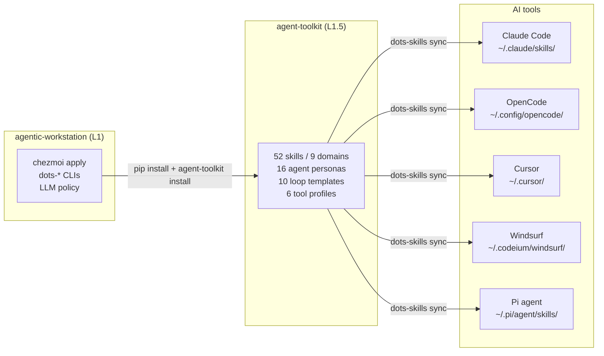

# Agent Toolkit Integration

> agentic-workstation provisions the machine. agent-toolkit distributes capabilities.

---

## Overview

[`agent-toolkit`](https://github.com/ulises-jeremias/agent-toolkit) is the capability distribution
layer for agentic-workstation. It provides a curated library of skills, agent personas, loop
templates, and tool profiles — one source of truth deployed to every major AI coding assistant.

agentic-workstation's role is **machine provisioning**: chezmoi, shell tools, packages, and LLM
policy. Skills, agents, and profiles are agent-toolkit's responsibility.



---

## What agent-toolkit provides

| Category | Count | Examples |
|----------|-------|---------|
| Skills | 52 (9 domains) | code-review, github-cli-workflow, jira, confluence, dbt-validation |
| Agent personas | 16 | architect, planner, code-reviewer, security-reviewer, tdd-guide |
| Loop templates | 10 | oss-pr-monitor, oss-triage, oss-daily-briefing, ci-health |
| Tool profiles | 6 | Claude Code, Cursor, OpenCode, GitHub Copilot, Windsurf, Pi |
| MCP templates | 6 | github, slack, notion, linear, figma, clickup |
| Solution packs | 3 | oss-ecosystem, startup-delivery, enterprise-ops |

### Skill domains

| Domain | Skills | Key examples |
|--------|--------|-------------|
| `core` | 8 | memory, planning, context injection, session bootstrap |
| `delivery` | 9 | code-review, github-cli-workflow, gh-fix-ci, pr-fallback, commit |
| `design` | 6 | ui-ux-pro-max, figma-implement-design, design-system-rules |
| `forge` | 7 | feature-dev, tdd, refactor-cleaner, simplify, code-connect |
| `integrations` | 8 | jira, confluence, slack, linear, clickup, notion |
| `data` | 5 | dbt-validation, snowflake-validation, pipeline-review |
| `tooling` | 6 | git-worktrees, docker, ci-cd, env-setup, keybindings |
| `ops` | 3 | incident, security-review, performance-optimizer |
| `loops` | 10 | oss-pr-monitor, oss-triage, ci-health, release-notes |

---

## How agentic-workstation integrates agent-toolkit

### Automatic install via chezmoi

During `chezmoi apply`, the `run_onchange_45-install-ai-agents.sh.tmpl` script:

1. Checks if `agent-toolkit` is installed
2. If not: installs `agent-toolkit-cli` via uv/pipx/pip
3. Runs `agent-toolkit install` — deploys skills, agents, and profiles for all detected AI tools
4. Calls `dots-skills sync` — creates per-tool symlinks from the deployed skill directories

### Manual install / update

```bash
# Via dots-skills (recommended — also runs sync)
dots-skills install-toolkit

# Or directly via pip + agent-toolkit
pip install agent-toolkit-cli
agent-toolkit install

# Update to latest
dots-skills install-toolkit    # upgrades package + re-deploys
# or:
pip install --upgrade agent-toolkit-cli && agent-toolkit install
```

### dots-skills delegates to agent-toolkit

`dots-skills` is the agentic-workstation CLI for skill management. It works alongside chezmoi and
wraps `agent-toolkit` for the primary skill library:

```
dots-skills install-toolkit      Install or update agent-toolkit
dots-skills sync                 Regenerate per-tool symlinks (works for all skill sources)
dots-skills list                 List all installed skills with per-tool symlink status
dots-skills check                Validate required CLI tools for each skill
```

### dots-loop wraps agent-toolkit loop

`dots-loop` is a thin wrapper around both `agent-toolkit loop` and `ai-workspace`'s `bin/loop`:

```bash
dots-loop init oss-pr-monitor    # init from agent-toolkit loop template
dots-loop run oss-pr-monitor     # run via ai-workspace
dots-loop status                 # check all loop states
agent-toolkit loop sync          # pull latest loop templates from agent-toolkit
```

---

## Skill sources after integration

agentic-workstation now has three layers of skills:

| Source | Install mechanism | Location | Examples |
|--------|------------------|----------|---------|
| **agent-toolkit** | `agent-toolkit install` (via chezmoi) | `~/.local/share/agentic-workstation/skills-external/agent-toolkit/` | 52 cross-domain skills |
| **Bundled (machine-local)** | chezmoi source state | `~/.local/share/agentic-workstation/skills/` | dots-workstation-triage, dots-workstation-assistant |
| **External** | `dots-skills install` / chezmoiexternal | `~/.local/share/agentic-workstation/skills-external/` | jira-assistant pack, npm skills |

> [!NOTE]
> agentic-workstation's bundled skills are intentionally small — they handle machine-local
> workflows (triage, assistant orchestration, dev-companion, harness sync). Everything else
> comes from agent-toolkit.

---

## LLM policy is agentic-workstation-only

`dots-devcompanion` LLM policy enforcement stays entirely in agentic-workstation. agent-toolkit has
no LLM provider awareness — it distributes static skill/agent content only.

For client engagements, configure the policy before queuing any background jobs:

```bash
export DOTS_AI_DEVCOMPANION_LLM_ALLOWLIST="anthropic"
export DOTS_AI_DEVCOMPANION_LLM_STRICT="1"
dots-devcompanion llm-status    # verify policy — never invokes a model
```

See [`docs/DEV_COMPANION_LLM.md`](DEV_COMPANION_LLM.md) for the full policy reference.

---

## Claude Code Plugin Marketplace

agent-toolkit also ships as Claude Code and Cursor plugin bundles for users who prefer the
marketplace install path (no pip required):

```
/plugin marketplace add ulises-jeremias/agent-toolkit
/plugin install agent-toolkit-core@agent-toolkit
/plugin install agent-toolkit-agents@agent-toolkit
/plugin install agent-toolkit-forge@agent-toolkit
```

This is an alternative to the chezmoi-managed install. On agentic-workstation machines, the
`chezmoi apply` path is preferred because it also configures per-tool profiles and loop templates.

---

## See Also

- [SKILLS.md](SKILLS.md) — Full skills system documentation
- [LOOPS.md](LOOPS.md) — Loop engineering and reference patterns
- [ARCHITECTURE.md](ARCHITECTURE.md) — Three-layer architecture (L1 / L1.5 / L3)
- [AI_LAYER.md](AI_LAYER.md) — AI directory structure and Ralph Loop model
- [DEV_COMPANION_LLM.md](DEV_COMPANION_LLM.md) — LLM policy (agentic-workstation-only)
- [agent-toolkit repo](https://github.com/ulises-jeremias/agent-toolkit) — capability source
