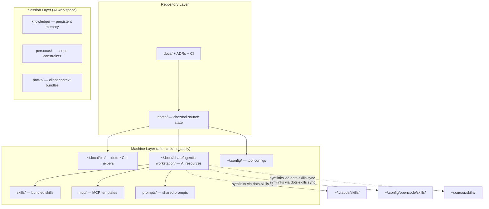
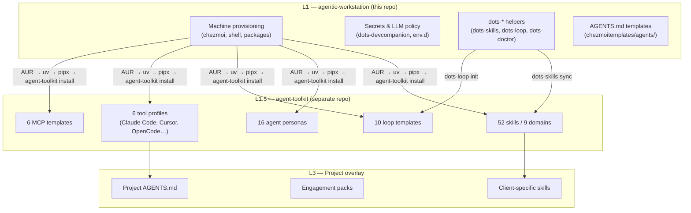

# Architecture

> Layered design model and source state conventions for the agentic-workstation workstation.

---

`agentic-workstation` keeps repository governance and workstation state clearly separated.

## Design principles

- Keep the source state simple and predictable.
- Prefer profile-driven behavior over host-specific custom logic.
- Keep scripts idempotent and safe to re-run.
- Treat docs, wiki, and ADRs as first-class product artifacts.

---

## Layered model

### Layer details

1. **Data model** (`home/.chezmoidata`)
   Shared configuration for package groups, AI settings, profiles, and the skills registry index.
2. **Bootstrap scripts** (`home/.chezmoiscripts`)
   Idempotent setup scripts executed by `chezmoi`. Includes skills sync via `dots-skills sync`.
3. **Templates** (`home/.chezmoitemplates`)
   Reusable AI instruction templates for projects and assistants.
4. **Shared assets** (`home/private_dot_local/share/agentic-workstation`)
   Prompts, skills, templates, MCP provider examples, and the runtime skills registry.
5. **CLI helpers** (`home/private_dot_local/bin`)
   Internal operations commands with `dots-` prefix, including `dots-skills`.

---

## Three-layer model

agentic-workstation operates across three distinct layers with clear separation of concerns:

### Layer responsibilities

| Layer | Repo | Responsibility |
|-------|------|----------------|
| **L1** | `agentic-workstation` | Machine provisioning — chezmoi, packages, shell, LLM policy |
| **L1.5** | `agent-toolkit` | Capability distribution — skills, agents, profiles, loops |
| **L3** | Project repo | Overlays — project AGENTS.md, engagement packs, client skills |

> [!IMPORTANT]
> **agentic-workstation's role is machine provisioning.** Skills, agent personas, and profiles come from [`agent-toolkit`](https://github.com/ulises-jeremias/agent-toolkit). `dots-skills` delegates to `agent-toolkit` for skill sync; `dots-loop` wraps `agent-toolkit loop`.

---

## Skills architecture

Skills are distributed by [agent-toolkit](https://github.com/ulises-jeremias/agent-toolkit) — a separate repo with 52 skills, 16 agent personas, and 10 loop templates. agentic-workstation installs agent-toolkit during `chezmoi apply` and uses `dots-skills` to sync the resulting skills to per-tool directories.

- **agent-toolkit skills** — installed via `agent-toolkit install` (or `uv tool install agent-toolkit-cli && agent-toolkit install`)
- **Bundled workstation skills** — a small set of agentic-workstation-specific skills (triage, dev-companion, assistant) shipped in this repo for machine-local workflows
- **External skills** — installed from npm, GitHub, or URLs by `dots-skills install`, placed in `~/.local/share/agentic-workstation/skills-external/`

Each skill contains a `skill.json` manifest (or `SKILL.md` frontmatter for agent-toolkit skills) that declares compatibility with each AI tool. `dots-skills sync` reads those manifests and creates symlinks in tool-specific directories (e.g. `~/.claude/skills/`, `~/.copilot/skills/`).

> [!NOTE]
> See [SKILLS.md](SKILLS.md) for the full skills system documentation.
> See [AGENT_TOOLKIT.md](AGENT_TOOLKIT.md) for the agent-toolkit integration reference.

---

## Source state convention

- `.chezmoiroot` points to `home`.
- The repository root stays dedicated to docs, CI, project metadata, and shared schemas.
- `lib/schemas/` contains JSON Schema definitions (e.g. `skill.schema.json`).

> [!IMPORTANT]
> Never place chezmoi-managed files at the repository root. All source state lives under `home/`.

---

## See Also

- [SKILLS.md](SKILLS.md) — full skills system documentation
- [AGENT_TOOLKIT.md](AGENT_TOOLKIT.md) — agent-toolkit integration (skills, agents, profiles)
- [AI_LAYER.md](AI_LAYER.md) — AI directory structure and Ralph Loop model
- [AGENTIC_HARNESS.md](AGENTIC_HARNESS.md) — three-layer architecture framework
- [wiki/PROFILES.md](wiki/PROFILES.md) — profile selection and feature groups
- [adrs/](adrs/) — architecture decision records
