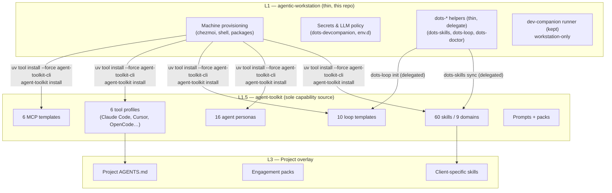

# Architecture

> Layered design model and source state conventions for the **thin** agentic-workstation.


---

`agentic-workstation` keeps repository governance and workstation state clearly separated. The thin workstation delegates all capability content to `agent-toolkit` via `uv`.

## Design principles

- Keep the source state simple and predictable — no embedded skills/packs/personas/agents/MCPs.
- Prefer profile-driven behavior over host-specific custom logic.
- Keep scripts idempotent and safe to re-run — single installer path (`uv tool install --force`).
- Treat docs, wiki, and ADRs as first-class product artifacts.

---

## Layered model — thin workstation

```mermaid
graph TD
    subgraph "Repository Layer"
        A[docs/ + ADRs + CI] --> B[home/ — chezmoi source state (thin)]
    end

    subgraph "Machine Layer (after chezmoi apply) - thin"
        B --> C["~/.local/bin/ — dots-* CLI helpers (thin, delegate)"]
        B --> D["~/.local/share/agentic-workstation/ — runner only"]
        B --> E["~/.config/ — tool configs"]
        D --> F["dev-companion/runner — workstation-only logic"]
        D --> G["scopes/ — workstation-only"]
        D -.->|"delegated via uv tool install --force agent-toolkit-cli"| H["agent-toolkit provides: skills, agents, MCP, prompts, loops"]
    end

    subgraph "Session Layer (AI workspace)"
        I["knowledge/ — persistent memory"]
        J["personas/ — scope constraints (via toolkit)"]
        K["packs/ — client context bundles (via toolkit)"]
    end

    H -.->|symlinks via dots-skills sync (delegated)| L["~/.claude/skills/"]
    H -.->|symlinks via dots-skills sync (delegated)| M["~/.config/opencode/skills/"]
    H -.->|symlinks via dots-skills sync (delegated)| N["~/.cursor/skills/"]
    H -.->|symlinks via dots-skills sync (delegated)| O["~/.agents/skills/"]
```

### Layer details — thin

1. **Data model** (`home/.chezmoidata`)
   Shared configuration for package groups, AI settings, profiles. Skills registry is empty — catalog comes from toolkit.
2. **Bootstrap scripts** (`home/.chezmoiscripts`)
   Thin install: `run_once_after_50-install-agent-toolkit.sh.tmpl` runs `uv tool install --force agent-toolkit-cli && agent-toolkit install`. `run_onchange_42-install-swarm-tooling.sh.tmpl` installs swarm prerequisites (tmux + Herdr + `herdr integration install opencode`) when `install_group_swarm=true`. `run_onchange_45` delegates to `agent-toolkit install`.
3. **Shared assets — thin** (`home/dot_local/share/agentic-workstation`)
   Only workstation-only runner logic: `dev-companion/runner`, `scopes`, `telemetry`, `pacman-hooks`. No `skills/*`, `loops/*`, `mcp/*`, `prompts/*`, `packs/teams`. Swarm isolation uses per-run tmux socket `agent-toolkit-swarm-<run-id>`; no `~/.tmux.conf` overwrite.
4. **CLI helpers — thin** (`home/dot_local/bin`)
   `dots-skills`, `dots-loop`, `dots-devcompanion` etc. delegate to `agent-toolkit` where applicable. `dots-doctor` validates swarm prerequisites (`tmux`, `herdr`, `agent-toolkit swarm doctor`, `herdr integration list --json`).

---

## Three-layer model — thin

agentic-workstation operates across three distinct layers with clear separation of concerns:



### Layer responsibilities — thin

| Layer | Repo | Responsibility |
|-------|------|----------------|
| **L1** | `agentic-workstation` (thin) | Machine provisioning + runner — chezmoi, packages, shell, LLM policy, `dev-companion/runner` |
| **L1.5** | `agent-toolkit` (sole source) | Capability distribution — skills, agents, profiles, loops, MCP, prompts, packs |
| **L3** | Project repo | Overlays — project AGENTS.md, engagement packs, client skills |

> [!IMPORTANT]
> **Thin workstation: all capabilities are delegated.** No `skills/*`, `loops/*`, `mcp/*`, `prompts/*`, `packs/teams`, `agents/*`, `rules/*` are embedded. Install via `uv tool install --force agent-toolkit-cli && agent-toolkit install`. `SKILL.md` catalog is provided by the toolkit at runtime.

---

## Skills architecture — thin

Cross-domain skills are **solely** distributed by [agent-toolkit](https://github.com/ulises-jeremias/agent-toolkit) — 60 skills, 16 agent personas, 10 loop templates, 6 MCP templates. agentic-workstation's `home/dot_local/share/agentic-workstation/skills/` retains only workstation-specific orchestration skills (assistant, triage, dev-companion, workflow-generic-project, etc.); cross-domain skills are installed at `skills-external/agent-toolkit/`. Third-party packs (JIRA 14, Confluence 17) live in `skills-external/{jira,confluence}-assistant/` and never in `plugins/`.

- **agent-toolkit skills** — installed via `uv tool install --force agent-toolkit-cli && agent-toolkit install`
- **No bundled workstation skills** — previous bundled dirs have been removed; workstation-only logic remains in `dev-companion/runner`
- **No embedded loops/MCP/prompts/packs** — all provided by toolkit

Each toolkit skill contains `SKILL.md` frontmatter that declares compatibility. `agent-toolkit install` + `dots-skills sync` creates symlinks in tool-specific directories.

> [!NOTE]
> See [SKILLS.md](SKILLS.md) for the full skills system documentation.
> See [AGENT_TOOLKIT.md](AGENT_TOOLKIT.md) for the thin delegation reference.

---

## Swarm provisioning — Workstation installs, Toolkit orchestrates

> **Workstation installs tools, Toolkit owns orchestration.** agentic-workstation provisions the host dependencies for [Agent Toolkit Swarms](SWARM_SETUP.md) (tmux + Herdr + OpenCode integration) via profile-driven chezmoi. Swarm orchestration, recipes, and isolated tmux sessions are owned by `agent-toolkit`.

- **tmux** — always installed in core + swarm group (apt/brew/pacman/dnf). Verified: `tmux -V`. Uses isolated socket `agent-toolkit-swarm-<run-id>`; no `~/.tmux.conf` overwrite.
- **Herdr** — idempotent install via `brew` → `mise` → `curl -fsSL https://herdr.dev/install.sh | sh` fallback (logged to `/tmp/herdr-install.log`). Skip in CI unless `SWARM_FORCE_INSTALL=1`. Check: `herdr --version`. When `install_group_swarm=false`, missing herdr is a warning; when true, `tmux` missing is a failure and `herdr` missing is a warning (tmux fallback).
- **OpenCode Herdr integration** — optional, idempotent: `herdr integration install opencode` when both binaries are present. Creates `~/.config/opencode` safely if missing. Verify: `herdr integration list --json`. Re-run when `herdr integration list --json` reports `outdated`.

**Doctor & recipes (Toolkit owns orchestration):**

```bash
dots-doctor                 # includes tmux, herdr, and swarm checks (profile-aware)
agent-toolkit swarm doctor  # toolkit-level swarm validation
herdr integration install opencode
agent-toolkit swarm start --recipe pair --ui herdr --runner opencode "Task"
agent-toolkit swarm start --recipe pair --ui tmux --runner opencode "Task"
# Swarm help lives in toolkit: agent-toolkit swarm --help
```

Profile mapping: `technical`, `non-technical`, `ai`, `data` enable `swarm` group (`install_group_swarm=true`) via `home/.chezmoidata/profiles.yaml`; `custom` can opt-in via questionnaire `Install Agent Toolkit Swarms (tmux + Herdr)?`. Non-interactive: `WORKSTATION_PROFILE=custom chezmoi init --apply ... --promptString install_group_swarm=yes`. Update re-runs `run_onchange_42-install-swarm-tooling.sh.tmpl` idempotently; `dots-uninstall` does not auto-remove tmux/herdr; no destructive `~/.tmux.conf` overwrite.

See [SWARM_SETUP.md](SWARM_SETUP.md) for full provisioning, doctor, and troubleshooting reference. Also see [AGENT_TOOLKIT.md](AGENT_TOOLKIT.md) and [PLATFORM_SUPPORT.md](PLATFORM_SUPPORT.md).

---

## Source state convention

- `.chezmoiroot` points to `home`.
- The repository root stays dedicated to docs, CI, project metadata, and shared schemas.
- `lib/schemas/` contains JSON Schema definitions (e.g. `skill.schema.json`) — kept for reference but not used for embedded skills in thin mode.
- Thin placeholders (`README.md`) remain in emptied dirs to document delegation.

> [!IMPORTANT]
> Never place chezmoi-managed files at the repository root. All source state lives under `home/`. Thin workstation keeps only runner logic.

---

## See Also

- [SKILLS.md](SKILLS.md) — full skills system documentation
- [AGENT_TOOLKIT.md](AGENT_TOOLKIT.md) — agent-toolkit integration — thin workstation (uv only)
- [SWARM_SETUP.md](SWARM_SETUP.md) — swarm provisioning — tmux + Herdr (Workstation installs, Toolkit orchestrates)
- [PLATFORM_SUPPORT.md](PLATFORM_SUPPORT.md) — platform support and swarm install paths
- [COMPATIBILITY.md](COMPATIBILITY.md) — compatibility matrix and swarm troubleshooting
- [AI_LAYER.md](AI_LAYER.md) — AI directory structure and Ralph Loop model
- [AGENTIC_HARNESS.md](AGENTIC_HARNESS.md) — three-layer architecture framework
- [wiki/PROFILES.md](wiki/PROFILES.md) — profile selection and feature groups
- [wiki/QUESTIONNAIRE.md](wiki/QUESTIONNAIRE.md) — init questionnaire including swarm opt-in
- [wiki/CLI.md](wiki/CLI.md) — CLI helpers including swarm doctor
- [adrs/](adrs/) — architecture decision records
