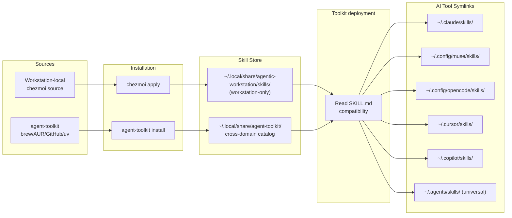

# Skills

This document describes the agentic-workstation skill system — how skills are defined, distributed, installed, and made available to multiple AI tools.

> [!IMPORTANT]
> **Skills are now distributed via [`agent-toolkit`](https://github.com/ulises-jeremias/agent-toolkit).**
> agentic-workstation provisions your machine. agent-toolkit provides the capability library
> (116+ skills, 17 agent personas, 10 loop templates). See [AGENT_TOOLKIT.md](AGENT_TOOLKIT.md) for
> the integration details.
>
> **Quick install:**
> ```bash
> # agent-toolkit is installed automatically by chezmoi apply.
> # To install or update manually (brew / AUR / GitHub / uv V launcher):
> dots-skills install-toolkit
>
> # Explicit uv fallback (V launcher wheel, 1.11.0+):
> uv tool install --force 'agent-toolkit-cli>=1.11.0'
> agent-toolkit install
> ```

## Skill Lifecycle



> [!NOTE]
> `dots-skills sync` is called automatically on every `chezmoi apply`. You only need to run it manually after editing `skills-registry.yaml` directly.

## What is a skill?

A **skill** is a markdown document (plus optional supporting assets) that teaches an AI tool how to perform a specific workflow. Skills are loaded by AI tools at startup and influence how they respond to user requests.

Each skill lives in its own directory and always contains:

- `SKILL.md` — the main content read by AI tools (frontmatter + instructions)
- `skill.json` — machine-readable manifest for workstation-local skills (source, version, compatibility, requirements). Agent Toolkit capabilities declare compatibility in `SKILL.md` frontmatter.

The bundled **dots-workstation-assistant** skill is the **agentic-workstation Assistant** and **orchestrator**: it defines a **repository inspection order** (README → docs → `AGENTS.md` → CONTRIBUTING → PR templates → task runners → devcontainer → CI → configs → code), **conflict heuristics**, and **anti-duplication** rules. It ships `references/REPO_INSPECTION.md`, `references/ORCHESTRATION.md` (routing and delegation), and `references/AGENTS_TEMPLATE.md`; a chezmoi **project** starter lives at `home/.chezmoitemplates/agents/AGENTS.project.md.tmpl`. **`skill-catalog.yaml`** next to bundled skills lists **WHAT vs HOW**, **triggers**, and **`depends_on`** for routing. It remains useful **outside** this repository by anchoring on the **applied machine** (`~/.local/share/agentic-workstation/`, `dots-*`) when relevant. Future org playbooks should be **read from shipped paths**, not hardcoded in the skill body.

## Directory structure

```
~/.local/share/agentic-workstation/skills/           # Workstation-specific (thin) — only orchestration
│   skill-catalog.yaml                   # Routing metadata (WHAT/HOW, triggers, depends_on)
│   dots-workstation-triage/
│   │   SKILL.md
│   │   skill.json
│   dots-workstation-assistant/
│   │   SKILL.md
│   │   skill.json
│   │   references/
│   │       REPO_INSPECTION.md
│   │       ORCHESTRATION.md
│   │       AGENTS_TEMPLATE.md
│   dots-workstation-workflow-generic-project/
│   dots-workstation-dev-companion/
│   dots-workstation-workflow-client-bootstrap/
│   dots-slack-assistant/
│   dots-harness-knowledge-sync/
│
│   # Cross-domain skills (Jira, Confluence, clickup-cli, github-cli-workflow,
│   # figma*, dbt-validation, etc.) are installed by agent-toolkit at:
│
~/.local/share/agent-toolkit/skills/              # Agent Toolkit catalog
    integrations/jira-assistant/
    integrations/confluence-assistant/
    ...

~/.local/share/agentic-workstation/dev-companion/    # Optional queue + worker (see README.md)
~/.local/share/agentic-workstation/third-party/      # Small attributed third-party excerpts (e.g. everything-claude-code)
```

AI tools access skills through symlinks in their respective config directories:

| Tool | Skills directory |
|------|-----------------|
| Claude Code | `~/.claude/skills/` |
| GitHub Copilot CLI | `~/.copilot/skills/` |
| Cursor | `~/.cursor/skills/` |
| OpenCode | `~/.config/opencode/skills/` |
| pi agent | `~/.pi/agent/skills/` |

## Skill sources

Skills come from the Toolkit catalog or the small workstation-local set:

| Source | Mechanism | Example |
|--------|-----------|---------|
| `agent-toolkit` | `agent-toolkit install` (via chezmoi) | 116+ cross-domain skills (`agent-toolkit inventory`) |
| `bundled` | chezmoi source state | `dots-workstation-triage`, `dots-workstation-assistant` (workstation-only) |

**`agent-toolkit` is the primary source for cross-domain skills.** It is installed automatically during `chezmoi init` via `run_once_after_50-install-agent-toolkit.sh.tmpl` (and kept current by `run_onchange_45-install-ai-agents.sh.tmpl` on subsequent `chezmoi apply` runs). `dots-skills install-toolkit` provides the manual equivalent.

## The `skill.json` manifest

Workstation-local skills use `skill.json` alongside `SKILL.md`. This is the machine-readable manifest used by `dots-skills` for local installation, syncing, and compatibility checks. Agent Toolkit capabilities instead use their `SKILL.md` frontmatter.

### Schema

```json
{
  "$schema": "https://raw.githubusercontent.com/ulises-jeremias/agentic-workstation/main/lib/schemas/skill.schema.json",
  "name": "my-skill",
  "version": "1.0.0",
  "description": "Short description used by AI tools in skill selection.",
  "source": "bundled",
  "author": "agentic-workstation",
  "tags": ["tag1", "tag2"],
  "requires": ["some-cli-tool"],
  "compatibility": {
    "claude-code":  { "supported": true },
    "copilot-cli":  { "supported": true },
    "cursor":       { "supported": true },
    "opencode":     { "supported": true },
    "pi":           { "supported": false, "notes": "Format not supported yet" },
    "windsurf":     { "supported": true }
  }
}
```

### Fields

| Field | Required | Description |
|-------|----------|-------------|
| `name` | Yes | Unique kebab-case identifier |
| `version` | Yes | Semver string, for example `"1.0.0"` |
| `description` | Yes | Short description for skill selection UI |
| `source` | Yes | `bundled`, `npm`, `github`, or `url` |
| `compatibility` | Yes | Per-tool support declarations |
| `package` | When `source: npm` | npm package name |
| `repo` | When `source: github` | `"owner/repo"` format |
| `ref` | When `source: github` | Git ref, defaults to `"main"` |
| `url` | When `source: url` | Direct download URL |
| `author` | No | Author or org name |
| `tags` | No | Searchable tags |
| `requires` | No | CLI tools that must be installed |
| `pip_packages` | No | Python packages to install via uv/pip |

The full JSON Schema lives at [`lib/schemas/skill.schema.json`](../lib/schemas/skill.schema.json).

### Compatibility matrix

The `compatibility` object must declare support for each AI tool. Only skills with `"supported": true` for a given tool will have a symlink created in that tool's skills directory.

Known tool keys:

| Key | Tool |
|-----|------|
| `claude-code` | Anthropic Claude Code |
| `copilot-cli` | GitHub Copilot CLI |
| `cursor` | Cursor editor |
| `opencode` | OpenCode terminal agent |
| `pi` | pi coding agent |
| `windsurf` | Windsurf editor |

> **Principle**: a skill must explicitly declare support for each tool. Agent Toolkit capabilities express it in `SKILL.md`; workstation-local skills without a compatibility matrix are treated as universally compatible.

> [!TIP]
> Use `dots-skills list` to see all installed skills with their per-tool symlink status at a glance.

## The Skills Registry (`skills-registry.yaml`)

`home/.chezmoidata/skills-registry.yaml` documents skills known to this baseline (same content as **`home/dot_local/share/agentic-workstation/skills-registry.yaml`**, which chezmoi deploys to `~/.local/share/agentic-workstation/skills-registry.yaml` for `dots-skills`). It is used by `dots-skills` for **bundled and npm** sources.

```yaml
skills:
  # Bundled: workstation-specific orchestration (only these remain bundled)
  - name: dots-workstation-assistant
    source: bundled
    enabled: true

  - name: workflow-generic-project
    source: bundled
    enabled: true
    # NOTE: workflow-generic-project is a DEPRECATED alias (enabled: false in registry);
    # prefer dots-workstation-workflow-generic-project.

  # Cross-domain skills (Jira, Confluence, clickup-cli, github-cli-workflow,
  # dbt-validation, figma*, etc.) are provided by agent-toolkit. They are not
  # registered here; install them with dots-skills install-toolkit.
```

## Imported skills (Apache-2.0 from openai/skills)

Ten skills in this baseline are derived from the curated set in
[openai/skills](https://github.com/openai/skills) (`skills/.curated/`), all
Apache-2.0 licensed:

| agentic-workstation skill | Upstream | Domain | Notes |
|---|---|---|---|
| `gh-address-comments` | `gh-address-comments` | forge | PR review-comment triage via `gh`. Pairs with `github-cli-workflow`. |
| `gh-fix-ci` | `gh-fix-ci` | forge | GitHub Actions failure triage. Plan-before-implement. |
| `linear` | `linear` | linear | Linear MCP workflows for issues, cycles, and docs. |
| `figma` | `figma` | figma | Entry point for the Figma MCP family. |
| `figma-implement-design` | `figma-implement-design` | figma | Design to code with 1:1 fidelity. |
| `figma-code-connect-components` | `figma-code-connect-components` | figma | Code Connect mappings. |
| `figma-create-design-system-rules` | `figma-create-design-system-rules` | figma | Generate agent rules for design systems. |
| `figma-create-new-file` | `figma-create-new-file` | figma | Create a new Figma file from scratch. |
| `playwright-cli` | `playwright` | testing | CLI-first browser automation. Renamed to disambiguate from `dots-workstation-e2e-runner`. |
| `jupyter-notebook` | `jupyter-notebook` | research | Scaffold reproducible notebooks; exposed via `dots-newnotebook`. |

Each imported skill keeps the upstream `LICENSE.txt` and adds a `NOTICE.txt`
documenting dots-workstation-side modifications. Common changes:

- Removed Codex-specific paths (`CODEX_HOME`, `~/.codex/skills/...`) and
  flags (`sandbox_permissions`, `[features].rmcp_client`). Replaced with the
  chezmoi-managed install location and tool-agnostic guidance for Claude
  Code, Cursor, OpenCode and Windsurf.
- Replaced `agents/openai.yaml` and `metadata.short-description` with the
  agentic-workstation [`skill.json` schema](#the-skilljson-manifest).
- Dropped vendor logo assets (`assets/*.svg`, `assets/*.png`).
- Added cross-references to agentic-workstation counterparts (`github-cli-workflow`,
  `dots-workstation-e2e-runner`, `dots-workstation-planning`, etc.).

### Out-of-scope (opt-in pack, not bundled)

Two heavier skills from the same upstream are intentionally **not bundled**
because they ship large reference payloads and have very specific use cases.
They are documented as "opt-in pack" in cross-references inside the bundled
figma family:

- `figma-use` (~692 KB; includes the Figma Plugin API standalone typings) —
  required prerequisite for any `use_figma` MCP call.
- `figma-generate-design` and `figma-generate-library` — depend on `figma-use`.

A future PR will publish these as a separate opt-in skill pack, installable
via `chezmoiexternal` + an `install_skill_figma_use_pack` flag (analogous to
`agent-toolkit install`). Use it only when a workflow needs `use_figma`; the
bundled `figma-implement-design`, `figma-code-connect-components`, and
`figma-create-new-file` cover the most common design-to-code workflows.

Jira and Confluence are already included in the Agent Toolkit catalog and do
not require an external archive or an opt-in skill-pack flag.

### MCP templates

Two new MCP templates ship with this batch (deployed to
`~/.local/share/agentic-workstation/mcp/`):

- `mcp/linear/` — streamable-HTTP, OAuth at `https://mcp.linear.app/mcp`. No
  env vars required.
- `mcp/figma/` — streamable-HTTP with `Authorization: Bearer
  ${FIGMA_OAUTH_TOKEN}` and `X-Figma-Region: ${FIGMA_REGION}`. Store the
  token in `~/.config/agentic-workstation/env.d/figma.env`.

See [`docs/MCP_TEMPLATES.md`](MCP_TEMPLATES.md) for the registration matrix.

## Jira and Confluence via Agent Toolkit

The Jira and Confluence skills are vendored upstream capabilities in
`agent-toolkit`. Install the Toolkit once; it deploys those skills with the
rest of the catalog and does not download separate skill archives.

```bash
dots-skills install-toolkit
agent-toolkit install
agent-toolkit inventory
```

The AI profile provisions the host CLIs used by the skills. To install them
manually, run `uv tool install jira-as` and `uv tool install confluence-as`.
Store Atlassian credentials in `~/.config/agentic-workstation/env.d/`, never in
project `.env` files or chezmoi source state. See the Jira and Confluence wiki
pages for the required environment variables.

## Managing skills with `dots-skills`

`dots-skills` is the CLI helper for skill management. It works alongside chezmoi and delegates to `agent-toolkit` for the primary skill library:

```
dots-skills list                 List installed skills and their status per AI tool
dots-skills sync                 Regenerate symlinks (reads skill.json or defaults to all tools)
dots-skills install-toolkit      Install or update agent-toolkit (brew/AUR/GitHub/uv V launcher + agent-toolkit install)
dots-skills install <name>       Install an npm-sourced skill from the registry
dots-skills check                Validate required CLI tools and pip packages for each skill
dots-skills add npm:<pkg>        Add an npm skill to the registry
```

> **Note**: The cross-domain catalog, including Jira and Confluence, comes from `agent-toolkit`. Use `dots-skills install-toolkit` or `agent-toolkit install` to install or update it. Optional standalone npm/GitHub additions are outside the Toolkit marketplace products and must declare their own installation path.

### `dots-skills list`

Shows all discovered skills with their source and symlink status per AI tool:

```
NAME                SOURCE   VERSION    claude-code    copilot-cli    cursor
dots-workstation-assistant  bundled  2.1.3      ✓ linked       ✓ linked       ✓ linked
# Cross-domain capabilities are listed by: agent-toolkit skills list
```

### `dots-skills sync`

Delegates to `agent-toolkit install` when the Toolkit CLI is available. Otherwise, it synchronizes workstation-local skills using their `skill.json` compatibility matrix (or universal support when absent). It is idempotent and safe to re-run.

If a skill is listed in `skills-registry.yaml` with **`enabled: false`**, it is **skipped** (no symlinks created), and any existing symlinks pointing at that skill are **removed**. Skills not listed in the registry are treated as enabled. **Workflow** and **dev companion** skills default to **`enabled: true`** in the baseline registry; use **`enabled: false`** to opt out (see [CLIENT_AI_PLAYBOOKS.md](CLIENT_AI_PLAYBOOKS.md)).

Called automatically by `run_onchange_45-install-ai-agents.sh.tmpl` on every `chezmoi apply`.

After installation, runs `dots-skills sync` automatically.

### `dots-skills check`

For each skill that is **not** disabled via `skills-registry.yaml` (`enabled: false`), checks that every tool listed in `requires` is available in `$PATH`. Reports missing tools with install suggestions.

## Bundled Best Practices skills

The workstation bundles atomic agentic-workstation Best Practices skills for common delivery artifacts. They stay small by keeping reusable Markdown bodies in each skill's `references/default-template.md`, while `SKILL.md` handles routing and guardrails.


Final artifacts must first run the `dots-workstation-output-handshake`: confirm the destination and require human review. Repository instructions, project templates, and engagement packs override these defaults.

Project assessment skills are fully interactive: they ask where each evidence source lives, build an evidence map, and separate confirmed findings from assumptions and missing evidence before scoring management or technical units.

### Project Assessment Skills

Use the assessment skills when a user asks for a project assessment, maturity review, quality indicator review, delivery audit, technical unit assessment, management unit assessment, or AI-readiness review.


The default flow is:

1. Run `dots-workstation-output-handshake` before final reports: ask where the final artifact should live and who will review it.
2. Use `dots-workstation-project-assessment` to define purpose, period, audience, and assessment units.
3. Use `dots-workstation-project-assessment-evidence` to ask where evidence lives. Evidence may be in repositories, boards, docs, dashboards, incident records, PRs, meeting notes, interviews, Slack, email, spreadsheets, or other systems.
4. Use `dots-workstation-technical-unit-assessment` and/or `dots-workstation-management-unit-assessment` to score only indicators with evidence.
5. Record confidence, assumptions, missing evidence, and validation needs before creating recommendations.
6. Create follow-up work items only after explicit approval, delegating writes to the relevant ticket tool skill.

### Project Assessment Use Cases


### Example Chats

End-to-end assessment:

```text
User: Run a project assessment for this engagement.
Assistant: I will use dots-workstation-project-assessment. Where should the final report live, and who will review it?
User: Put the draft in docs/assessment.md. I will review it.
Assistant: What period and units should be assessed? Should this cover management, technical units, or both?
User: Last quarter, both. The backend and data pipeline are the technical units.
Assistant: I will collect evidence first. Where are the repositories, board, planning docs, dashboards, incidents, decisions, and stakeholder feedback?
```

Technical-only assessment:

```text
User: Assess the cloud infrastructure and CI/CD maturity.
Assistant: I will use dots-workstation-project-assessment-evidence and dots-workstation-technical-unit-assessment. Where are the IaC repo, pipeline history, deployment docs, monitoring dashboards, security scans, and incident records?
```

Management-only assessment:

```text
User: Review project governance and delivery health.
Assistant: I will use dots-workstation-project-assessment-evidence and dots-workstation-management-unit-assessment. Where are the board, backlog, planning notes, retrospectives, risks, delivery reports, decisions, agreements, and stakeholder feedback?
```

Missing evidence:

```text
User: Score observability based on what you can see.
Assistant: I can inspect the repository, but observability scoring also needs dashboards, alerts, logs, or incident evidence. Where can I find those sources? If they are unavailable, I will mark the indicator as missing evidence or low confidence.
```

Follow-up actions:

```text
User: Convert the assessment gaps into tasks.
Assistant: I can draft follow-up tasks from the confirmed findings. Which ticket system or file should receive them, and do you approve creating work items for the high-priority gaps?
```

## Adding a new skill

> [!IMPORTANT]
> For client/project skills, follow the naming and workflow rules in [CLIENT_AI_PLAYBOOKS.md](CLIENT_AI_PLAYBOOKS.md). Do not mix multiple workflow drivers on the same task.

### Client and project bundled skills

For **client engagement** or **project-specific** AI workflows, use the naming and **workflow** rules in [CLIENT_AI_PLAYBOOKS.md](CLIENT_AI_PLAYBOOKS.md). Register new skills in `skills-registry.yaml`; set **`enabled: false`** when a skill should stay off by default for most engineers.

### Bundled skill (in this repo)

1. Create `home/dot_local/share/agentic-workstation/skills/<name>/` (chezmoi source path under `home/`)
2. Add `SKILL.md` with YAML frontmatter and content
3. Add `skill.json` with the manifest
4. Add an entry to `home/.chezmoidata/skills-registry.yaml`
5. Run `chezmoi apply` — `dots-skills sync` will create the symlinks automatically

### External skill (from npm)

1. Find the npm package that exposes a `SKILL.md` (e.g. `example-npm-skill`) — historical `uipro-cli` / `ui-ux-pro-max` pack was removed in [#197](https://github.com/ulises-jeremias/agentic-workstation/pull/197); do not use `uipro_cli` flag
2. Add an entry to `skills-registry.yaml`:
   ```yaml
   - name: my-skill
     source: npm
     package: my-skill-npm-pkg
     enabled: true
   ```
3. Run `dots-skills install my-skill` or `chezmoi apply`

### External skill (from GitHub)

1. Create a repo with `SKILL.md` + `skill.json` at the root
2. Add an entry to `skills-registry.yaml`:
   ```yaml
   - name: my-skill
     source: github
     repo: myorg/my-skill
     ref: v1.0.0
     enabled: true
   ```
3. Run `dots-skills install my-skill`

## Multi-tool compatibility guidelines

When writing a skill, always declare compatibility explicitly. If you are unsure whether a tool supports the skill format, set `"supported": false` with a note.

**Do** declare support only after testing:
```json
"cursor": { "supported": true }
```

**Do** add notes when support is partial or has caveats:
```json
"pi": { "supported": false, "notes": "pi does not load external skill files yet" }
```

**Don't** assume "works everywhere" — the point of the compatibility matrix is to make this explicit and opt-in per tool.

## Publishing a skill to npm

If you want to share a skill publicly via npm:

1. Create a package with `SKILL.md` and `skill.json` at the root
2. The `skill.json` `source` should still reflect the intended distribution method (`npm`)
3. Publish normally: `npm publish`
4. Other users can add it to their `skills-registry.yaml` as an `npm` source skill

Example minimal `package.json` for a skill package:

```json
{
  "name": "my-awesome-skill",
  "version": "1.0.0",
  "description": "My awesome AI skill",
  "files": ["SKILL.md", "skill.json", "scripts/", "data/"]
}
```

---

## Knowledge Base Write API

Skills that sync discoveries to the ai-workspace knowledge base use the stable `assistant-memory` API with the `--from-skill` flag for origin tracking.

### API Reference

```bash
assistant-memory add --type <type> --from-skill <skill-name> [--tags a,b,c] <content>
```

| Flag | Required | Description |
|------|----------|-------------|
| `--type` | Yes | Entry type: `skill`, `process`, `learning`, `todo` |
| `--from-skill` | Yes (for cross-repo skills) | Origin skill name |
| `--tags` | No | Comma-separated tags |
| `content` | Yes | Free-text entry content |

### Example (from a skill)

```bash
assistant-memory add --type learning --from-skill my-skill "Pattern: always verify X"
assistant-memory add --type skill --from-skill my-skill --tags jira,workflow "New workflow pattern"
```

### Version negotiation

Skills should probe for `--from-skill` support and fall back gracefully:

```bash
assistant-memory add --type learning --from-skill test "probe" >/dev/null 2>&1 \
  && echo "API available" \
  || echo "fall back to plain add"
```

---

## See Also

- [AGENT_TOOLKIT.md](AGENT_TOOLKIT.md) — agent-toolkit integration (skills, agents, profiles, loops)
- [AI_LAYER.md](AI_LAYER.md) — AI layer overview and directory structure
- [CLIENT_AI_PLAYBOOKS.md](CLIENT_AI_PLAYBOOKS.md) — Client-specific skill workflows
- [DEV_COMPANION.md](DEV_COMPANION.md) — Dev companion layers (uses skills)
- [ARCHITECTURE.md](ARCHITECTURE.md) — High-level architecture overview
- [adrs/004-skills-compatibility-matrix.md](adrs/004-skills-compatibility-matrix.md) — ADR: Skills system design
- [ai-workspace docs/KNOWLEDGE.md](https://github.com/ulises-jeremias/ai-workspace/blob/main/docs/KNOWLEDGE.md) — Full API reference
